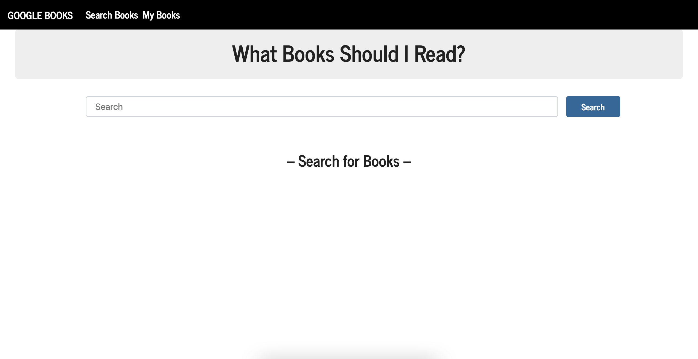

# Google Books Reading List READme

## Description
This MERN stack site application allows users to search the Google Books API to then save the individual entiries they are interested in to a reading list. The application accomplishes this by saving search results that are rendered through a react state to a MongoDB database. The API routes allow for both saving and deleting to the MongoDB database.
## Table of Contents
- [Installation](#installation)
- [Usage](#usage)
- [Contact](##questions?)

## Installation
To install necessary dependencies for forked and locally hosted repositories, run the following command:

    npm i

## Usage
Books can be searched on the search page, and are simply saved by selecting "Save" on result entries. To view and delete unwanted saved books, the 'My Books' page allows for either.
### Demo

---  

## Questions?
If you come across any issues with the repo, please open an issue, or contact me directly at: anth8nyc@gmail.com. More of my work is avaiable on GitHub at [anth8nyc](https://github.com/anth8nyc/).

